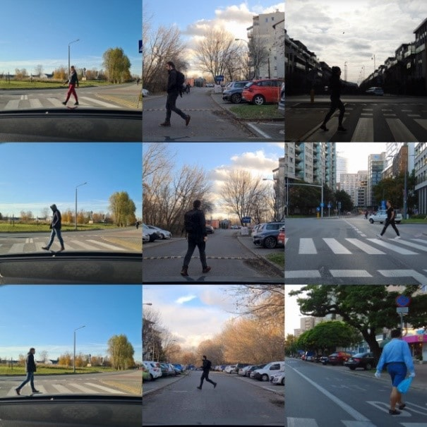
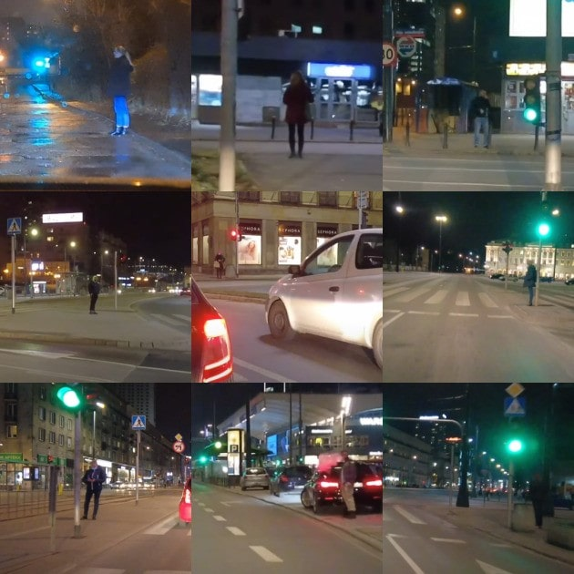
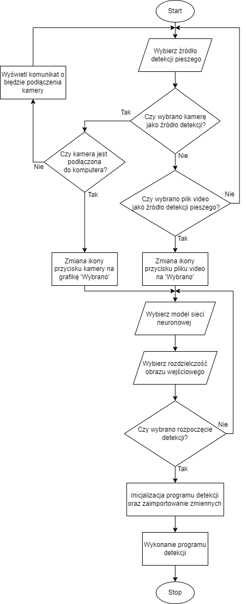
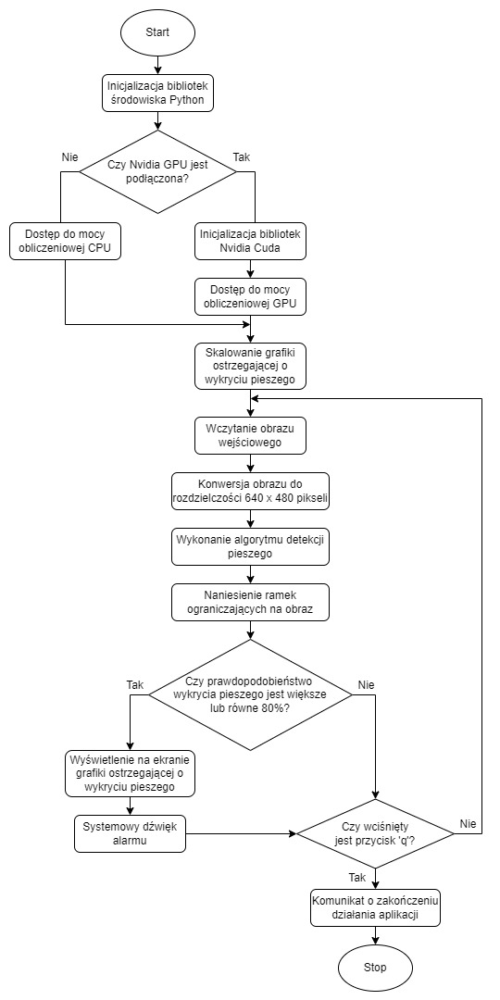

# Pedestrian detection app

This article is intended to consider the impact of processing distorted data on the effectiveness of pedestrian detection on the road. These distortions can be caused by many unpredictable factors, such as motion blur, loss of record quality, poor lighting or weather conditions. In connection with this, the author especially focused on the analysis of modern tools which are enabling object detection in real time.

## Technologies
Python3.7, TensorFlow, Tkinter, OpenCV, Google Colab

## Presentation

An example of how the application works:

.gif)

Preparing a set of training data on the Warsaw's streets - 3000 photos divided into several categories:

Graphical user inferface algorithm:

Detection app algorithm:

