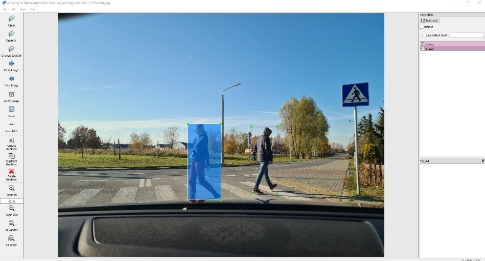

# Pedestrian detection app

## Intro
My engineering thesis mainly focused on considering the impact of processing distorted data on the effectiveness of pedestrian detection on the road. These distortions can be caused by many unpredictable factors, such as motion blur, loss of record quality, poor lighting or weather conditions. In connection with this, I especially focused on the analysis of modern tools that enable real time object detection.
The application allows the use of three different convolutional network models trained using transfer learning for detection.

## Conclusions
The tests conducted for the purposes of the thesis demonstrated that the optimal neural network model for use in the developed application is the Faster RCNN v1 640x640 model. It achieved an average detection probability of 84%, which is 7 percentage points higher than the SSD EfficientDet D0 512x512 model. 
The least optimal network model in the developed application was the SSD MobileNet v1 640x640 model, which obtained an average detection probability of 62% in the tests.
I also used the recorded test footage to evaluate the effectiveness of a pre-existing detection program. I decided to choose the Yolov4 network algorithm because, according to available online tests, it demonstrates very good detection performance. For the test recordings, the average pedestrian detection probability was 95%. To improve the detection effectiveness further, it would be necessary to use a larger dataset of image data, encompassing more pedestrian positions and various environmental conditions.

## Technologies
Python3.7, TensorFlow, Tkinter, OpenCV, Google Colab

## Presentation

An example of how the application works:

.gif)

Preparing a set of training data on the Warsaw's streets - 3000 photos divided into several categories:

Graphical user inferface algorithm:

Detection app algorithm:

Data set processing:

